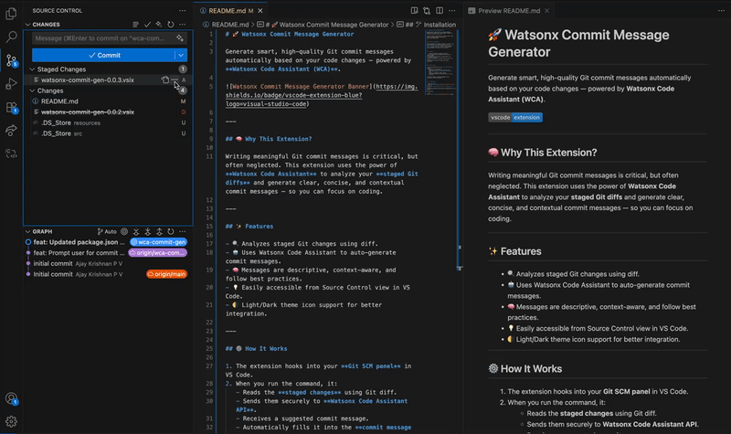

# 🚀 Watsonx Commit Message Generator

Generate smart, high-quality Git commit messages automatically based on your code changes — powered by **Watsonx Code Assistant (WCA)**.


---

## 🧠 Why This Extension?

Writing meaningful Git commit messages is critical, but often neglected. This extension uses the power of **Watsonx Code Assistant** to analyze your **staged Git diffs** and generate clear, concise, and contextual commit messages — so you can focus on coding.

---

## ✨ Features

- 🔍 Analyzes staged Git changes using diff.
- 🤖 Uses Watsonx Code Assistant to auto-generate commit messages.
- 🧠 Messages are descriptive, context-aware, and follow best practices.
- 💡 Easily accessible from Source Control view in VS Code.
- 🌗 Light/Dark theme icon support for better integration.

---

## ⚙️ How It Works

1. The extension hooks into your **Git SCM panel** in VS Code.
2. When you run the command, it:
   - Reads the **staged changes** using Git diff.
   - Sends them securely to **Watsonx Code Assistant API**.
   - Receives a suggested commit message.
   - Automatically fills it into the **commit message input box**.

> No manual typing, no generic messages — just intelligent, AI-assisted commits.

---

## 🛠 Installation

1. Open **VS Code**.
2. Go to the **Extensions** view (`Ctrl+Shift+X` or `Cmd+Shift+X`).
3. Click on **"Views and more action -> install from VSIX"**.
4. Select the **watsonx-commit-gen-0.0.3.vsix** and Install .

Alternatively,:

```bash
code --install-extension watsonx-commit-gen-0.0.3.vsix 

```

## 📽 Demo: How It Works

